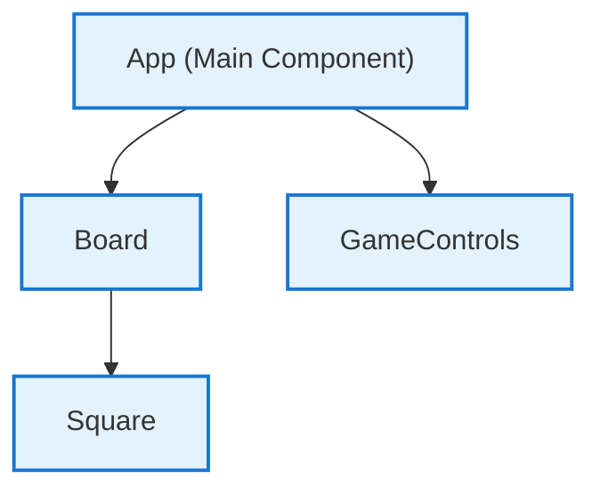

# Tic Tac Toe Frontend Architecture Overview

This document provides an architectural overview of the Tic Tac Toe frontend, detailing key components, UI structure, state handling (including in-memory score tracking), and the design rationale underlying the implementation.

## 1. Overview

The frontend of the Tic Tac Toe game is implemented in React, providing a modern, minimalistic, and fully responsive interface for two local players. The focus is on simplicity, clarity, and usability, with all game logic and UI state managed in memory (no backend or persistent storage).

## 2. Key Architectural Components

All key logic and UI for the game reside in a single main React component (`App`), with supporting smaller components:

### - `App` (Main Component)
- **Role**: Orchestrates the entire game, handling board state, current player, scoring, win checking, and UI layout.
- **State Variables**:
  - `squares` (array of 9): The tic tac toe board, each cell is `'X'`, `'O'`, or `null`.
  - `isXNext` (boolean): Tracks whose turn it is (`true` for "X", `false` for "O").
  - `score` (object): `{ X: number, O: number, Draw: number }` — in-memory tally of wins/draws.
  - `gameStatus` (object): `{ winner: "X"|"O"|"Draw"|null, winningLine: array }`
- **Logic**:
  - Handles all gameplay, including moves, checking win/draw logic, starting/restarting rounds, and managing the score.
  - Uses React's `useEffect` to determine the outcome after each move and update `score` and `gameStatus`.

### - `Board`
- **Role**: Displays a 3x3 game grid composed of `Square` buttons.
- **Props**:
  - `squares`: The game board array.
  - `onSquareClick`: Handler for a cell click.
  - `winningLine`: List of indices for squares that together form the winning line (used for highlighting).

### - `Square`
- **Role**: Represents a single clickable cell on the board.
- **Props**:
  - `value`: `'X'`, `'O'`, or `null`.
  - `onClick`: Callback to make a move.
  - `isWinning`: Whether this square is part of a winning line.
- **UI Logic**: Highlights winning squares and visually distinguishes "X" and "O" via color.

### - `GameControls`
- **Role**: Panel under the board that shows game status, winner, round/game controls, and the scoreboard.
- **Props**:
  - `currentPlayer`, `isGameOver`, `winner`, `onRestart`, `onNewGame`, `score`.

### - `calculateWinner` (utility function)
- **Role**: Determines if there's a winner or a draw after each move by examining the board state.

The compositional structure is straightforward:  
`App` ⟶ `Board` (and in turn: `Board` ⟶ `Square`)  
`App` ⟶ `GameControls`

## 3. UI Structure

The UI structure is described below; see the included Mermaid diagram for visual reference.

- **Header**: Game title (“TicTacToe”), with themed coloring, and a subtitle for mode/branding.
- **Main Section**:
    - **Board Section**: Centered board displayed using CSS flexbox. The 3x3 grid is rendered by combining 3 rows of 3 squares.
    - **Game Controls**: Displayed below the board; includes:
        - Current player indicator (color-coded).
        - Status message (whose move it is or winner/draw).
        - **Buttons**: “Restart Game” (clears board), “New Game” (clears board and score).
        - Scoreboard for X, O, and draws.
- **Footer**: Minimal, referencing React and the project.

## 4. In-Memory Score Handling

- **Approach**: All game scores (X wins, O wins, Draws) are tracked in a state object (`score`) held by `App`.
- **Persistence**: No scores are persisted beyond session; refreshing the app resets all state.
- **Update Logic**: When a game ends (win/draw), `score` is updated accordingly, and the winner/draw is displayed.  
  - “New Game” resets BOTH score and board.
  - “Restart Game” clears only the board (retaining score).

## 5. Design Rationale

- **Minimalism and Clarity**: Only essential information is shown at any time (e.g., whose turn, clear winner/draw display, unobtrusive controls).
- **Local Play Focus**: No backend or authentication. Every state update is local, responsive, and instant.
- **Accessibility**: Uses semantic elements and aria-labels for squares/status.
- **Highlighting / Feedback**: Visual emphasis via color and box-shadow for current player, win/draw, and active controls.
- **Responsiveness**: CSS grid sizing and media queries ensure game is playable on both desktop and mobile.
- **Single-File Source Simplicity**: All logic in `App.js` makes for learning-friendly code and easy maintenance for a small app.

## 6. Theming and Style

- **Theme**: Light theme using CSS custom properties for easy palette adjustments.
- **Palette**:  
  - Primary: `#3498db` (for "X")
  - Secondary: `#2ecc71` (for "O")
  - Accent: `#e74c3c` (for winning line and winner)
- **All layout and color customizations are performed in `App.css`** via CSS custom properties and named classes.

## 7. Extensibility

Due to encapsulated logic and clear state management, future enhancements (for example: AI opponent, online play, persistence) can be added with minimal restructuring.

---

This documentation accurately reflects the architecture as implemented in the codebase (see `src/App.js` and `src/App.css`). For customizations, adjust styles in `App.css` or expand logic in `App.js`.

